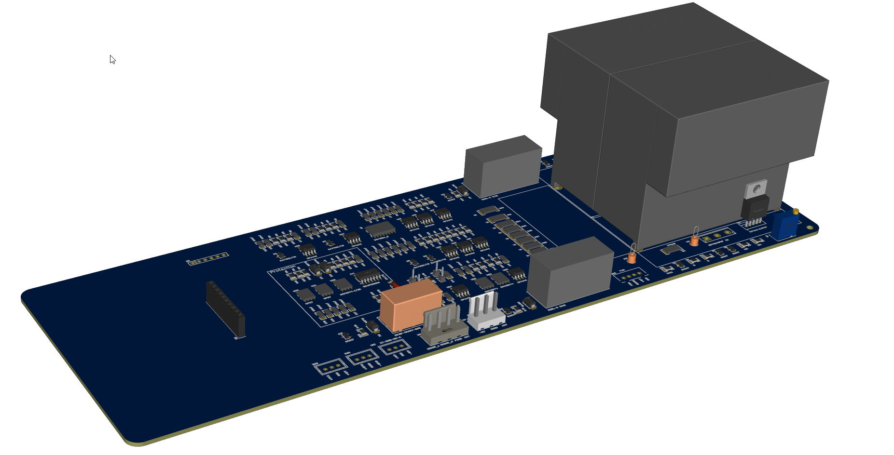
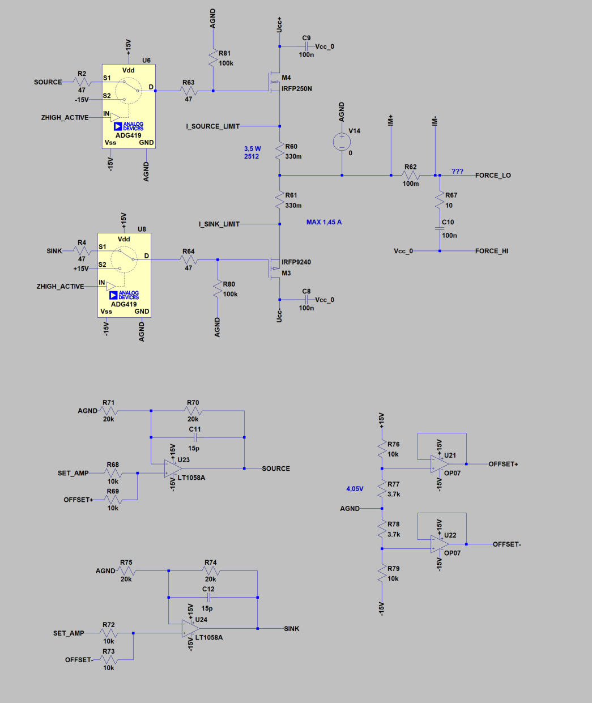
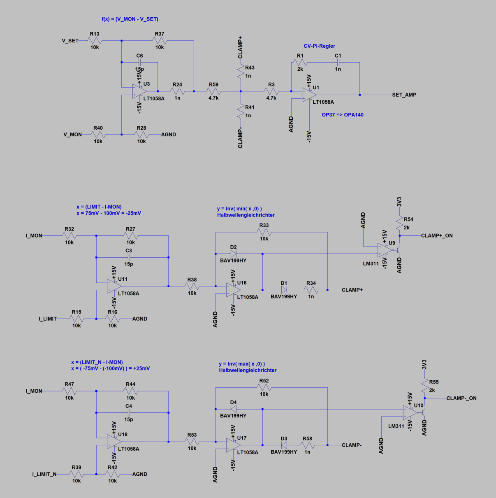
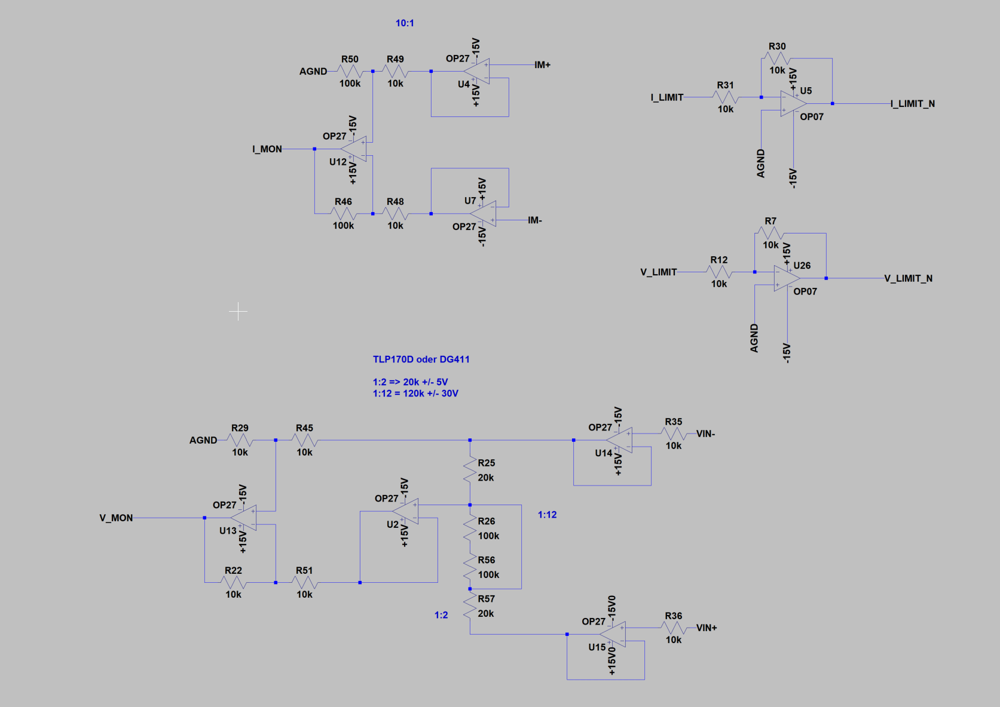
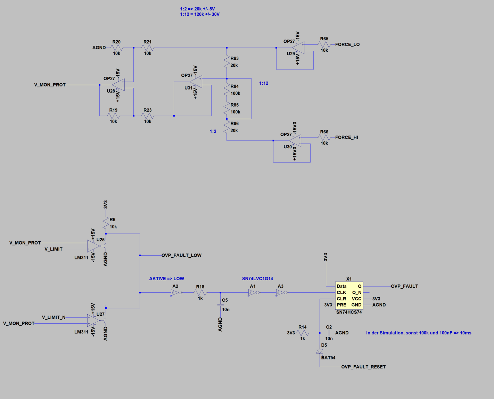

# A-SMU

## Floating High-Voltage Analog Source Measure Unit (Simulation)

# Was ist eine SMU?

Eine **Source Measure Unit (SMU)** ist ein Messgerät, das gleichzeitig:

-   Spannung oder Strom liefern (Source)
-   Spannung oder Strom aufnehmen (Sink)
-   Spannung und Strom messen (Measure)
-   nahtlos zwischen CV (Constant Voltage) und CC (Constant Current)
    wechseln

Eine SMU vereint damit:

-   Netzgerät
-   elektronische Last
-   Präzisionsmultimeter

in einem einzigen geschlossenen Regelkreis. Für eine detailiert Beschreibung schau bitte hier. [https://en.wikipedia.org/wiki/Source_measure_unit](https://en.wikipedia.org/wiki/Source_measure_unit)  

------------------------------------------------------------------------

# Motivation

Dieses Projekt ist inspiriert durch die Projekte von:

-  [J-SMU von Jaromir Sukuba](https://github.com/jaromir-sukuba/J-SMU) 
-  [DIY-SMU von Dave Erickson](https://www.djerickson.com/diy_smu/) 
  

Beide Projekte orientieren sich an einer klassischen Architektur der Keithley-SMUs 236 und zeigen, dass leistungsfähige SMUs diskret realisierbar sind.

Die A-SMU verfolgt jedoch zum Teil einen anderen, Analogansatz mit Fokus auf:

- Nur ein CV-PI-Regler (keine separate CC-Regelschleife)
- Strombegrenzung über differenzielle Clamp-Blöcke
(I_LIMIT − I_MON wird als Halbwellen-Signal in den Summenknoten des CV-Reglers injiziert)
- Explizite Hardware-Schutzmechanismen (Overvoltage Protection, OVP)
- Deterministische Endstufenabschaltung über Z-HIGH
- Galvanisch getrennte, vollständig floating Reglerdomäne
- High-Voltage-Endstufe ±30 V (perspektivisch erweiterbar)
- Noch kein GUARD, da ich das Konzept noch nicht verstanden habe.

Dieses ist ein Hobby-Projekt, jedoch mit einer ambitionieren Zielsetzung. 

## Zielparameter

- Ausgangsspannung: ±30 V (HV-Domain isoliert)
- Strom:
    - Range 1: ±0-1 A
    - Range 1: ±0-100 mA
- Spannung:
    - Range 1:  ±0-5V (1:2)
    - Range 2:  ±0-30V (1:12)
- OVP: 12-Bit DAC-gesteuert
- Reglerdomäne: ±15 V (floating)
- CV-Regler: PI, analog

------------------------------------------------------------------------

# Projektübersicht

Die **A-SMU (Analog Source Measure Unit)** ist eine vollständig diskret
aufgebaute, analog geregelte SMU-Architektur mit klar getrennter
Hochvolt- und Reglerdomäne.\
Das Projekt befindet sich aktuell im Simulationsstadium (LTspice) und
dient als Grundlage für meine A-SMU.
Teile der Systemarchitektur und Dokumentation wurden unter Verwendung von ChatGPT 5.2 entwickelt.

  
------------------------------------------------------------------------

# Architektur

## 1. Domänentrennung

### HV-Domain

-   ±30 V (perspektivisch ±100 V)
-   Versorgung der MOSFET-Endstufe
-   galvanisch isoliert

### Control / Regler-Domain

-   ±15 V Steuerspannung (galvanisch getrennt)
-   AGND floatet auf FORCE_LO
-   enthält CV-Regler, Clamp-Logik, OVP
-   keine Verbindung zu PE, USB oder System-GND

Diese Struktur verhindert Masseschleifen und ermöglicht echtes Floating.
Auf meiner ToDo-Liste steht noch eine Floating-Überwachung gegen PE.
Da ich kein Profi bin, sollte meine A-SMU auch gegen eine Fehlbedienung ausgelegt sein.

------------------------------------------------------------------------

# Funktionsblöcke

## 2. Ausgangsstufe

Diskrete Push-Pull-Endstufe mit:

-   IRFP250 (N-Kanal)
-   IRFP9240 (P-Kanal)
-   Source-Shunts: 0,1 Ω und 10R

Eigenschaften:

-   Linearbetrieb
-   symmetrisches Verhalten
-   Ruhestrom von ca. 50mA (Offset)
-   aktive Gate-Abschaltung über ZHIGH

  

------------------------------------------------------------------------

## 3. ZHIGH -- deterministisches Abschalten

ZHIGH ist eine Hardware-Sicherheitsfunktion.

Im aktiven Zustand:

-   Gate N-MOS → −15 V
-   Gate P-MOS → +15 V

Damit wird die Endstufe aktiv deaktiviert.\
Keine schwebenden Gates, kein undefiniertes Verhalten.

------------------------------------------------------------------------

## 4. CV-Regler (Spannungsregelung)

-   Ein PI-Regler
-   arbeitet vollständig in der floating Domain
-   Summenknoten erlaubt Clamp-Einspeisung

Der Regler ist bewusst einfach und deterministisch ausgelegt.

## 4.1. CC-Clamp-System (Strombegrenzung)

Getrennte positive und negative Clamp-Blöcke:

-   CLAMP+
-   CLAMP−

Diese wirken direkt auf den Summenknoten des CV-Reglers.

Vorteile:

-   stabile und saubere CV→CC Übergänge
-   keine Loop-Crossover-Probleme
-   symmetrisches Verhalten

Ein klassischer CC-Regler mit zusätzlichem Spannungs-Clamp führt bei externer Spannung (z. B. 2 V) und niedriger V_LIMIT (z. B. 1 V) zu 
instabilem Verhalten, da der Klemmblock den Ausgang auf maximalen Strom treiben kann.

Ich habe lange an einer saubern Klemmlösung mit sauberen und stabilen CV→CC Übergängen gearbeitet. 
Die Strombegrenzung erzeugt nur eine zusätzliche Fehlerspannung
Das System wechselt nicht zwischen zwei Reglern.
Es ist ein kontinuierlicher Übergang

  

------------------------------------------------------------------------

## 6. IMON -- Strommessung

Skalierung:

- ±1 V =>  ±1 A
- ±1 V =>  ±10 mA

Direkte analoge Repräsentation des Ausgangsstroms.\
Wird für Clamp-Erzeugung und ADC genutzt.

------------------------------------------------------------------------

## 7. VMON -- Spannungsmessung

Umschaltbare Skalierung:

-   1:2 =>  ±0..5V
-   1:12 => ±0..30V

Gebufferte Ausgabe für:

-   ADC
-   OVP-Vergleich
-   externe Messung

  
  
------------------------------------------------------------------------

## 8. OVP -- Überspannungsschutz

-   getrennte positive/negative Komparatoren
-   Latch-Logik
-   manuelles Reset erforderlich
-   kann ZHIGH auslösen

Verhindert automatisches Wiederanlaufen nach Fehler.

  

------------------------------------------------------------------------

# Aktueller Stand im Repository

Simulation umfasst:

-   vollständige analoge Architektur
-   MOSFET-Endstufe
-   CV-Regler
-   CC-Clamps
-   ZHIGH-Logik
-   OVP-Latch
-   IMON / VMON Skalierung

Simulationsplattform: LTspice

------------------------------------------------------------------------

# Status

Projekt befindet sich aktuell in der Simulationsphase.

Geplante nächste Schritte:

-   PCB-Layout der analogen Regelung inkl. Endstufe
    - Geplante Umsetzung mit easyeda pro   
-   Digital-Board ADC/DAC Lm199 und MCU
-   Spannungsversorgung
-   Software Touchdisplay mit EVE2 Diaplay 5 Zoll
-   P- und R-Regler

------------------------------------------------------------------------

# Lizenz

