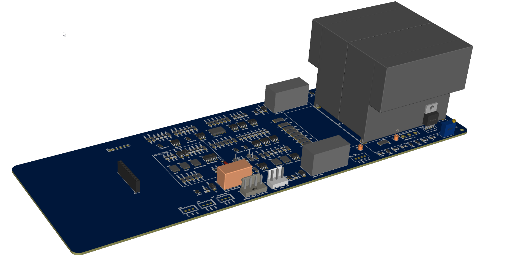
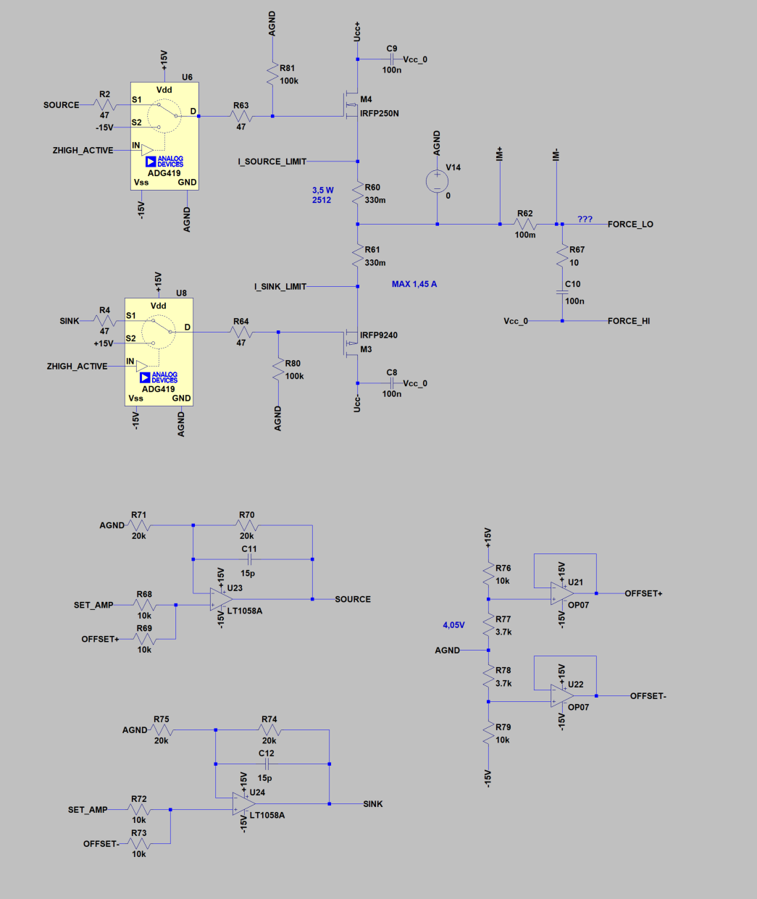
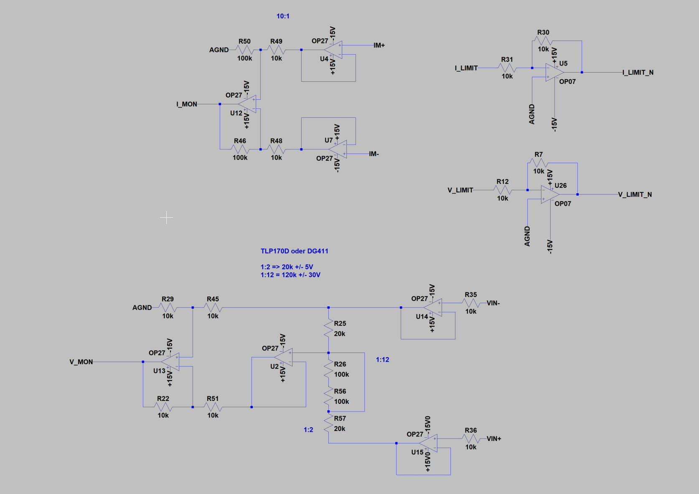
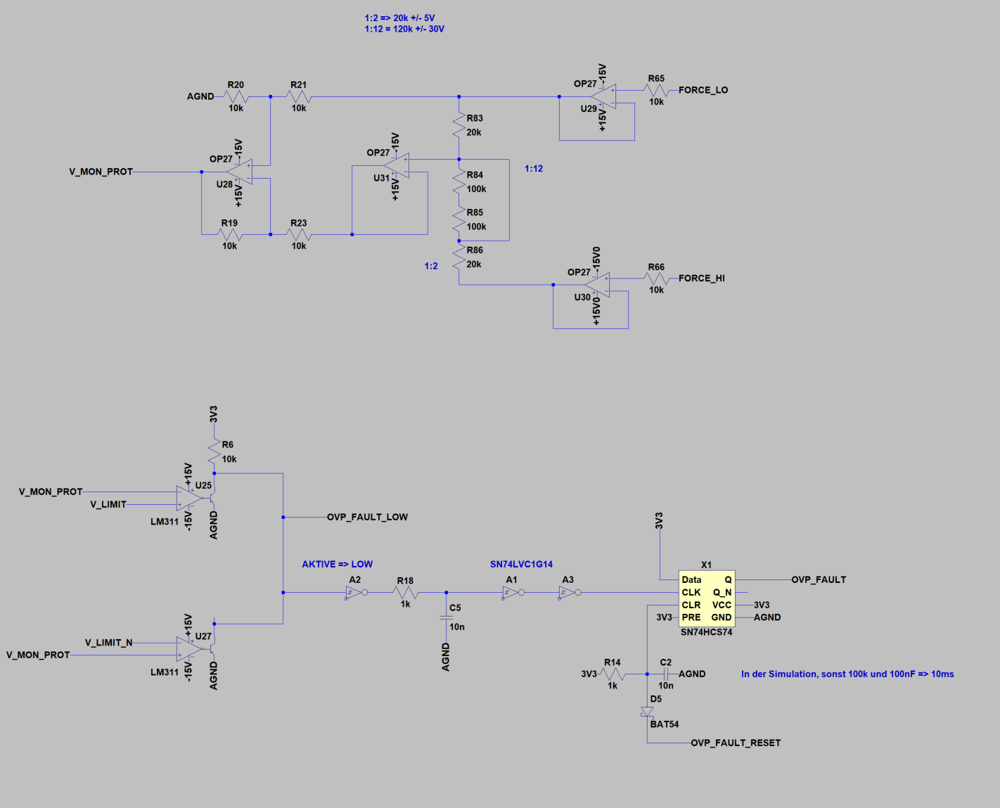

# A-SMU

## Floating High-Voltage Analog Source Measure Unit (Simulation)

# Was ist eine SMU?

Eine **Source Measure Unit (SMU)** ist ein Messgerät, das gleichzeitig:

-   Spannung oder Strom liefern (Source)
-   Spannung oder Strom aufnehmen (Sink)
-   Spannung und Strom messen (Measure)
-   nahtlos zwischen CV (Constant Voltage) und CC (Constant Current)
    wechseln

Eine SMU vereint damit:

-   Netzgerät
-   elektronische Last
-   Präzisionsmultimeter

in einem einzigen geschlossenen Regelkreis. Für eine detailiert Beschreibung schau bitte hier. [https://en.wikipedia.org/wiki/Source_measure_unit](https://en.wikipedia.org/wiki/Source_measure_unit)  

------------------------------------------------------------------------


# Motivation

Dieses Projekt ist inspiriert durch die Projekte von:

-  [J-SMU von Jaromir Sukuba](https://github.com/jaromir-sukuba/J-SMU) 
-  [DIY-SMU von Dave Erickson](https://www.djerickson.com/diy_smu/) 
  

Beide Projekte orientieren sich an einer klassischen Architektur der Keithley-SMUs 236 mit den Konzept, das ein Clamp-Blöcken in dem Summenknoten vom PI eingreifen.

Die A-SMU verfolgt jedoch ein anderes Konzept:

- Die A-SMU arbeitet als Spannungsregler (CV) mit symmetrischer Strombegrenzung (CC). Ein einziger invertierender PI-Regler    erhält über analoge min/max-Blöcke automatisch den begrenzenden Fehler. Keine digitale Modusumschaltung.
- Nahtlos zwischen CV (Constant Voltage) und CC (Constant Current) wechseln
- Deterministische Endstufenabschaltung über Z-HIGH
- Galvanisch getrennte, vollständig floating Reglerdomäne
- High-Voltage-Endstufe ±30 V (perspektivisch erweiterbar)
- Noch kein GUARD, da ich das Konzept noch nicht verstanden habe.

Dieses ist ein Hobby-Projekt, jedoch mit einer ambitionieren Zielsetzung. 

## Zielparameter

- Ausgangsspannung: ±30 V (HV-Domain isoliert)
- Strom:
    - Range 1: ±0-1 A
    - Range 1: ±0-100 mA
- Spannung:
    - Range 1:  ±0-5V (1:2)
    - Range 2:  ±0-30V (1:12)
- OVP: 12-Bit DAC-gesteuert
- Reglerdomäne: ±15 V (floating)
- CV-Regler: PI, analog


------------------------------------------------------------------------

# Projektübersicht

Die **A-SMU (Analog Source Measure Unit)** ist eine vollständig diskret
aufgebaute, analog geregelte SMU-Architektur mit klar getrennter
Hochvolt- und Reglerdomäne.\
Das Projekt befindet sich aktuell im Simulationsstadium (LTspice) und
dient als Grundlage für meine A-SMU.
Teile der Systemarchitektur und Dokumentation wurden unter Verwendung von Sonnet 4.6 entwickelt.

  
------------------------------------------------------------------------
# Gesamtformel

Aus drei Fehlersignalen wird durch analoge Min/Max-Verknüpfung der begrenzende Fehler selektiert:

```
error = max( min(f_V, f_I_LO), f_I_HI )
```

| Signal | Formel | Aktiv wenn... |
|---|---|---|
| f_V | V_MON − V_SET | Spannung weicht vom Sollwert ab (CV) |
| f_I_HI | I_MON − I_LIMIT | Strom überschreitet +Compliance (CC) |
| f_I_LO | I_MON − (−I_LIMIT) | Strom unterschreitet −Compliance (CC) |

Der Block implementiert eine symmetrische Strombegrenzung: Überschreitet der Ausgangsstrom die positive oder negative Compliance, übernimmt automatisch der entsprechende Stromregler -- der Spannungsregler tritt in den Hintergrund.
# Architektur

## 1. Domänentrennung

### HV-Domain

-   ±30 V (perspektivisch ±100 V)
-   Versorgung der MOSFET-Endstufe
-   galvanisch isoliert

### Control / Regler-Domain

-   ±15 V Steuerspannung (galvanisch getrennt)
-   AGND floatet auf FORCE_LO
-   enthält CV-Regler, Min/Max, OVP
-   keine Verbindung zu PE, USB oder System-GND

Diese Struktur verhindert Masseschleifen und ermöglicht echtes Floating.
Auf meiner ToDo-Liste steht noch eine Floating-Überwachung gegen PE.
Da ich kein Profi bin, sollte meine A-SMU auch gegen eine Fehlbedienung ausgelegt sein.

------------------------------------------------------------------------

# Funktionsblöcke

## 2. Ausgangsstufe

Diskrete Push-Pull-Endstufe mit:

-   IRFP250 (N-Kanal)
-   IRFP9240 (P-Kanal)
-   Source-Shunts: 0,1 Ω und 10R

Eigenschaften:

-   Linearbetrieb
-   symmetrisches Verhalten
-   Ruhestrom von ca. 50mA (Offset)
-   aktive Gate-Abschaltung über ZHIGH

  

------------------------------------------------------------------------

## 3. ZHIGH -- deterministisches Abschalten

ZHIGH ist eine Hardware-Sicherheitsfunktion.

Im aktiven Zustand:

-   Gate N-MOS → −15 V
-   Gate P-MOS → +15 V

Damit wird die Endstufe aktiv deaktiviert.\
Keine schwebenden Gates, kein undefiniertes Verhalten.

------------------------------------------------------------------------

## 4. CV-Regler (Spannungsregelung)

-   Ein PI-Regler
-   arbeitet vollständig in der floating Domain
-   Min/Max Fließend-Fehler-Umschaltung

Der Regler ist bewusst einfach und deterministisch ausgelegt.

## 5. Min/Max-Block -- automatische CV/CC-Arbitration

Der Min/Max-Block ist das Herzstück der A-SMU-Regelarchitektur. Er entscheidet automatisch, welches Fehlersignal den PI-Regler steuert -- ohne digitale Modusumschaltung.

### Funktion

Aus drei Fehlersignalen wird durch analoge Min/Max-Verknüpfung der begrenzende Fehler selektiert:

```
error = max( min(f_V, f_I_LO), f_I_HI )
```

| Signal | Formel | Aktiv wenn... |
|---|---|---|
| f_V | V_MON − V_SET | Spannung weicht vom Sollwert ab (CV) |
| f_I_HI | I_MON − I_LIMIT | Strom überschreitet +Compliance (CC) |
| f_I_LO | I_MON − (−I_LIMIT) | Strom unterschreitet −Compliance (CC) |

Der Block implementiert eine symmetrische Strombegrenzung: Überschreitet der Ausgangsstrom die positive oder negative Compliance, übernimmt automatisch der entsprechende Stromregler -- der Spannungsregler tritt in den Hintergrund.

### Implementierung

Realisiert mit Standard-Operationsverstärkern in Diodenlogik:

-   OPA140 als schneller, präziser Op-Amp
-   1N4148 Schaltdioden
-   100 Ω Serienwiderstände (zur Entkopplung der Diodenzweige)
-   Buffer-Stufe am Ausgang (OPA140) zur Lastunabhängigkeit

### Betriebsmodi

| Modus | Aktives Signal | Bedingung |
|---|---|---|
| CV | f_V | −I_LIMIT < I_MON < +I_LIMIT |
| CC+ | f_I_HI | I_MON ≥ +I_LIMIT |
| CC− | f_I_LO | I_MON ≤ −I_LIMIT |

Der Übergang zwischen den Modi ist stufenlos und vollständig analog -- es gibt keine Schaltschwelle, keinen Komparator und kein digitales Steuersignal.

  


------------------------------------------------------------------------

## 6. IMON -- Strommessung

Skalierung:

- ±1 V =>  ±1 A
- ±1 V =>  ±10 mA

Direkte analoge Repräsentation des Ausgangsstroms.

------------------------------------------------------------------------

## 7. VMON -- Spannungsmessung

Umschaltbare Skalierung:

-   1:2 =>  ±0..5V
-   1:12 => ±0..30V

Gebufferte Ausgabe für:

-   ADC
-   OVP-Vergleich
-   externe Messung

  
  
------------------------------------------------------------------------

## 8. OVP -- Überspannungsschutz

-   getrennte positive/negative Komparatoren
-   Latch-Logik
-   manuelles Reset erforderlich
-   kann ZHIGH auslösen

Verhindert automatisches Wiederanlaufen nach Fehler.

  

------------------------------------------------------------------------

# Aktueller Stand im Repository

Simulation umfasst:

-   vollständige analoge Architektur
-   MOSFET-Endstufe
-   CV-Regler
-   Min/Max-Block
-   ZHIGH-Logik
-   OVP-Latch
-   IMON / VMON Skalierung

Simulationsplattform: LTspice

------------------------------------------------------------------------

# Status

Projekt befindet sich aktuell in der Simulationsphase.

Geplante nächste Schritte:

-   PCB-Layout der analogen Regelung inkl. Endstufe
    - Geplante Umsetzung mit easyeda pro   
-   Digital-Board ADC/DAC Lm199 und MCU
-   Spannungsversorgung
-   Software Touchdisplay mit EVE2 Diaplay 5 Zoll
-   PI-Regler


------------------------------------------------------------------------

# Lizenz

