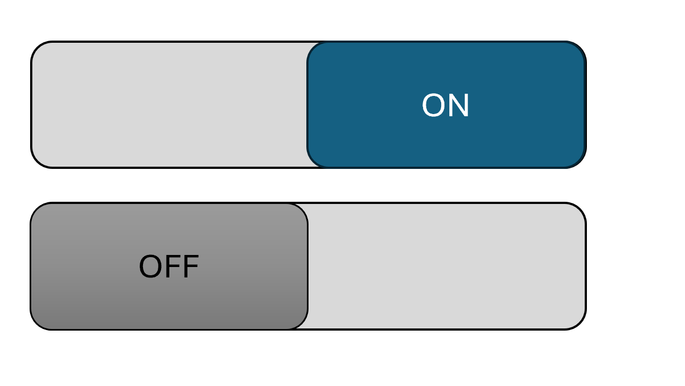
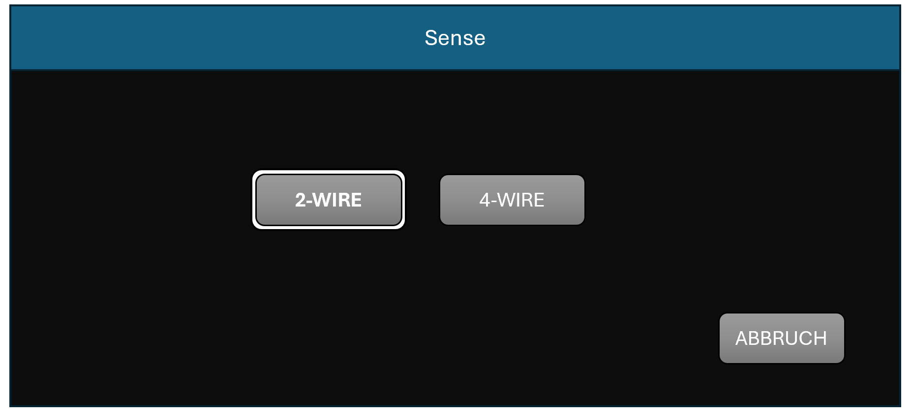
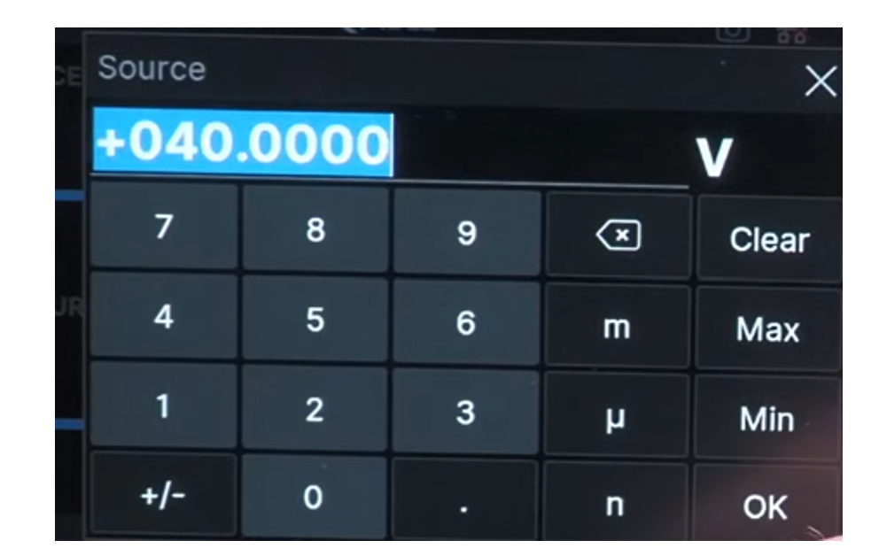
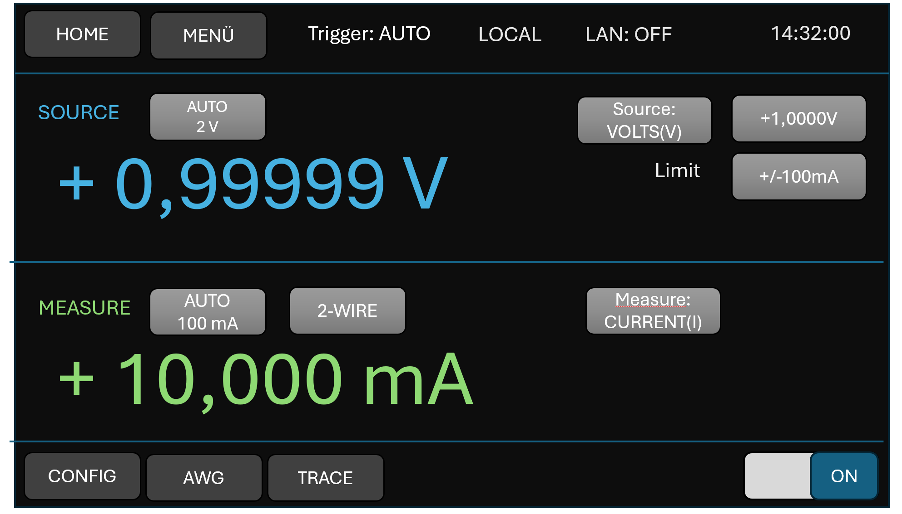

# A-SMU Bedienkonzept

Version: 0.5  
Status: Konzeptentwurf, Schritt 2  
Stand: 2026-06-28  
Basis: Siglent-SMM3000X als Bedienreferenz, nicht als 1:1-Kopie

---

## 1. Einleitung

Die A-SMU soll eine ruhige, klare und schnell verständliche Oberfläche bekommen.
Die Siglent-SMM3000X-Oberfläche wird als Referenz für die Grundidee verwendet:

- oben eine schmale Toolbar,
- links eine große Source-/Measure-Anzeige,
- rechts ein Setup-Bereich für Source, Limit, Range und Output,
- unten eine Softkey-Leiste für Detailmenüs.


---

## 2. Siglent-Vorlage richtig eingeordnet

Die Siglent-Oberfläche zeigt oben in der Toolbar im Prinzip globale Bedien- und Statusinformationen.
Werte wie Source, Measure, Limit, Range und 2-Wire/4-Wire liegen nicht vollständig in der Toolbar, sondern im Hauptbereich und im Channel-Setup.

Für die A-SMU übernehmen wir daher nur das Bedienprinzip:

```text
Toolbar      = Navigation und globaler Gerätestatus
Hauptbereich = große Mess- und Source-Werte
Setupbereich = einstellbare Parameter
Softkeys     = Detailfunktionen
```

### 2.1 Seiten- und Komponentenstruktur

Die GUI wird in Pages, Panels und Popups aufgeteilt.

```text
Page  = vollständige Hauptansicht
Panel = Teilbereich innerhalb einer Page
Popup = modaler Dialog über einer Page
```

Hauptansichten werden als `Page` bezeichnet, z.B.:

```text
MainPage
AWGPage
TracePage
MainMenuPage
GraphPage
```

Panels bleiben wiederverwendbare Bausteine innerhalb einer Page, z.B.:

```text
HeaderPanel
SourcePanel
MeasurePanel
MainConfigPanel
GraphPanel
```

Popups werden für Dialoge verwendet, z.B.:

```text
NumberPadPopup
SourceRangePopup
SelectDialog
```

Die Page ist für das Layout und die Sichtbarkeit ihrer Panels verantwortlich.
Domain-Werte und Einstellungen bleiben weiterhin ausschließlich in `SystemClass`.

### 2.2 Controls

Wir müssen für die GUI verschiedene Controls erstellen.
Wir hatten in der ersten Version einen Fokus für die Buttons eingebaut. Dieser ist aus meiner Sicht jedoch nicht notwendig,
da wir bei einer Auswahl nur den aktuell selektierten Modus umrahmen müssen.

Es ist wichtig, die Farben direkt in einer zentralen Code-Datei
abzulegen, z.B.:

```text
MAIN_SCREEN_BG_COLOR
TOOLBAR_BUTTON_BG_COLOR
TOOLBAR_BUTTON_FONT_COLOR
```

---

#### 2.2.1 Boolean-Button



#### 2.2.2 Label

Ein Label für z.B. LAN: Off oder Trigger: AUTO

#### 2.2.3 Auswahl/Umschaltung (Select-Dialog)

Für die Auswahl von z.B. dem Sense-Typ stellen wir immer einen Dialog bereit und kennzeichnen den aktuell aktiven Bereich.
Die Buttons in Auswahl-Dialogen verwenden dieselbe Hintergrund- und Schriftfarbe wie die Header-Buttons.



#### 2.2.4 Number-Pad

Das Number-Pad dient zur Eingabe von Werten. Wird ein Wert außerhalb des gültigen Bereichs angegeben, wird der Wert in Rot dargestellt und die Eingabe kann nicht mit "OK" bestätigt werden.
Die Buttons im Number-Pad verwenden dieselbe Hintergrund- und Schriftfarbe wie die Header-Buttons.



#### 2.2.5 Range-Button

Der Range-Button wird zweizeilig dargestellt.
Die erste Zeile zeigt, ob ein fixer Range oder Auto-Range aktiv ist.
Die zweite Zeile zeigt den aktuell verwendeten Bereich.

Beispiel bei festem Range:

```text
Range
5V
```

Beispiel bei Auto-Range:

```text
AUTO
5V
```

Bei Auto-Range zeigt die zweite Zeile immer den aktuell aufgelösten Bereich, z.B. `5V`, `30V`, `100mA` oder `1A`.


## 3. Toolbar-Konzept

### 3.1 Ziel der Toolbar

Die Toolbar soll nicht überladen werden.
Sie dient nur für globale Informationen und Navigation.


### 3.2 Vorschlag A-SMU Toolbar

```text
HOME | MENU | AUTO | LOCAL | LAN | 14:32
```


### 3.3 Bedeutung der Felder

| Feld | Bedeutung | Hinweis |
|---|---|---|
| `HOME` | zurück zum Hauptbildschirm | immer sichtbar |
| `MENU` | Hauptmenü öffnen | immer sichtbar |
| `AUTO` | Trigger-/Messstatus | Version 1 nur AUTO |
| `LOCAL` / `REMOTE` | Bedienzustand | REMOTE später über LAN/SCPI |
| `LAN` | Off | ON |
| Uhrzeit / Laufzeit | Zeitstatus | Uhrzeit oder Betriebszeit |

### 3.4 Zustände nur bei Bedarf

Warnungen werden nicht dauerhaft als Zahlen angezeigt, sondern als Statushinweis:

```text
TEMP WARN
FAN FAULT
OVP
OCP
OPEN SENSE
```

Beispiel bei Fehler:

```text
HOME | MENU | AUTO | LOCAL | LAN | FAULT: OVP
```

Die Schriftfarbe sollte sich deutlich unterscheiden:
ERROR_FONT_COLOR

---

## 4. Hauptscreen — Bereichsaufteilung

### 4.1 Grundlayout 800 × 480





Der Hauptscreen wird in vier Bereiche aufgeteilt:

| Bereich | Name | Aufgabe |
|---|---|---|
| A | Toolbar | globale Navigation und Status |
| B1 | Source-Anzeige | eingestellter Quellwert groß anzeigen |
| B2 | Measure-Anzeige | aktuellen Messwert groß anzeigen |
| C | Softkeys | Zugang zu Untermenüs |

---

Der On-Off-Button bleibt in allen Fenstern sichtbar,
damit wir auch in Trace-Fenster den Channel einschalten können.


---

## 5. Format-Darstellung

Wir sollten bei der Darstellung der Werte ein fixes Format vorgeben:

```text
VOLT(S)             +---,---- V  = 3,4
CURRENT(I)          +---,---- A  = 3,4
OHM(R)              +---,---- R  = 3,4
POWER(P)            +---,---- W  = 3,4

TEMP(C)             +-- C = 2,0
```
